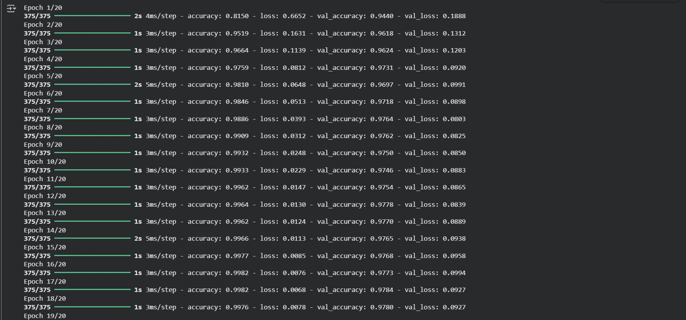
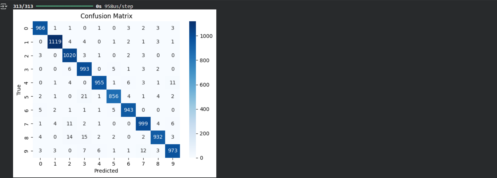
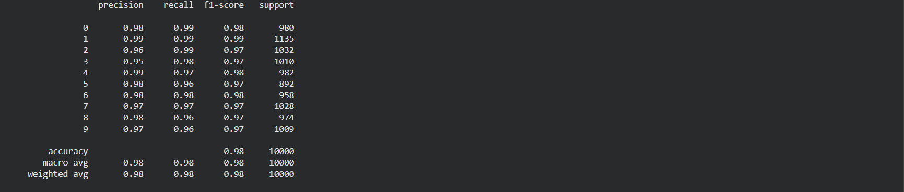
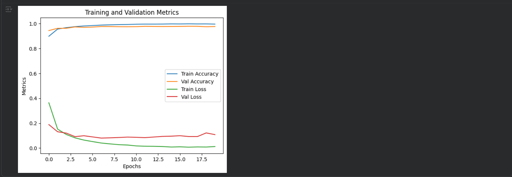
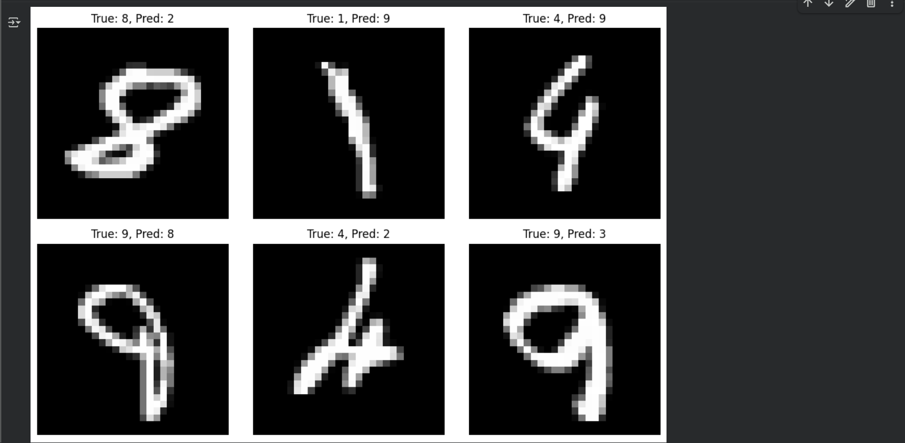
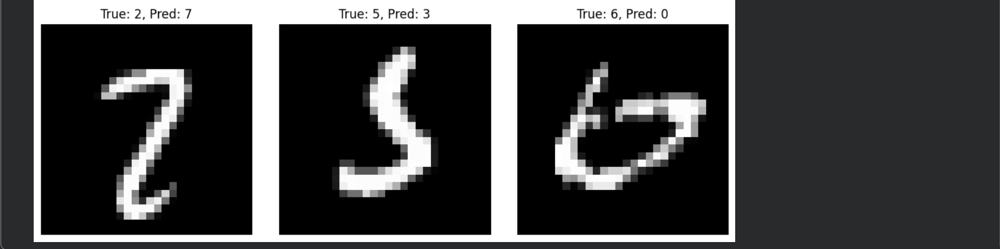

#Project Based Experiments
## Objective :
 Build a Multilayer Perceptron (MLP) to classify handwritten digits in python
## Steps to follow:
## Dataset Acquisition:
Download the MNIST dataset. You can use libraries like TensorFlow or PyTorch to easily access the dataset.
## Data Preprocessing:
Normalize pixel values to the range [0, 1].
Flatten the 28x28 images into 1D arrays (784 elements).
## Data Splitting:

Split the dataset into training, validation, and test sets.
Model Architecture:
## Design an MLP architecture. 
You can start with a simple architecture with one input layer, one or more hidden layers, and an output layer.
Experiment with different activation functions, such as ReLU for hidden layers and softmax for the output layer.
## Compile the Model:
Choose an appropriate loss function (e.g., categorical crossentropy for multiclass classification).Select an optimizer (e.g., Adam).
Choose evaluation metrics (e.g., accuracy).
## Training:
Train the MLP using the training set.Use the validation set to monitor the model's performance and prevent overfitting.Experiment with different hyperparameters, such as the number of hidden layers, the number of neurons in each layer, learning rate, and batch size.
## Evaluation:

Evaluate the model on the test set to get a final measure of its performance.Analyze metrics like accuracy, precision, recall, and confusion matrix.
## Fine-tuning:
If the model is not performing well, experiment with different architectures, regularization techniques, or optimization algorithms to improve performance.
## Visualization:
Visualize the training/validation loss and accuracy over epochs to understand the training process. Visualize some misclassified examples to gain insights into potential improvements.

# Program:

Dataset Acquisition

```python
import tensorflow as tf
from tensorflow.keras.datasets import mnist

# Load MNIST dataset
(x_train, y_train), (x_test, y_test) = mnist.load_data()

```

Data Preprocessing

```python
# Normalize pixel values to [0, 1]
x_train = x_train / 255.0
x_test = x_test / 255.0

# Flatten 28x28 images to 784-element vectors
x_train = x_train.reshape(-1, 784)
x_test = x_test.reshape(-1, 784)

# One-hot encode labels
y_train = tf.keras.utils.to_categorical(y_train, 10)
y_test = tf.keras.utils.to_categorical(y_test, 10)

```

Data Splitting

```python
from sklearn.model_selection import train_test_split

# Split training data into training and validation sets
x_train, x_val, y_train, y_val = train_test_split(x_train, y_train, test_size=0.2, random_state=42)

```

Model Architecture

```python
from tensorflow.keras.models import Sequential
from tensorflow.keras.layers import Dense

# Build MLP model
model = Sequential([
    Dense(128, activation='relu', input_shape=(784,)),
    Dense(64, activation='relu'),
    Dense(10, activation='softmax')
])

```

Compile the Model

```python
model.compile(
    optimizer='adam',
    loss='categorical_crossentropy',
    metrics=['accuracy']
)


```

Training

```python
history = model.fit(
    x_train, y_train,
    epochs=20,
    batch_size=128,
    validation_data=(x_val, y_val)
)

```

Evaluation

```python
# Evaluate on test set
test_loss, test_accuracy = model.evaluate(x_test, y_test)
print(f"Test Accuracy: {test_accuracy:.4f}")

```


Confusion Matrix

```python
import numpy as np
from sklearn.metrics import confusion_matrix, classification_report
import matplotlib.pyplot as plt
import seaborn as sns

# Predict classes
y_pred = model.predict(x_test)
y_pred_classes = np.argmax(y_pred, axis=1)
y_true = np.argmax(y_test, axis=1)

# Confusion matrix
cm = confusion_matrix(y_true, y_pred_classes)
sns.heatmap(cm, annot=True, fmt='d', cmap='Blues')
plt.xlabel('Predicted')
plt.ylabel('True')
plt.title('Confusion Matrix')
plt.show()

# Classification report
print(classification_report(y_true, y_pred_classes))

```

Visualization

```python
# Plot training history
plt.plot(history.history['accuracy'], label='Train Accuracy')
plt.plot(history.history['val_accuracy'], label='Val Accuracy')
plt.plot(history.history['loss'], label='Train Loss')
plt.plot(history.history['val_loss'], label='Val Loss')
plt.xlabel('Epochs')
plt.ylabel('Metrics')
plt.legend()
plt.title('Training and Validation Metrics')
plt.show()

```

Misclassified Examples

```python
import matplotlib.pyplot as plt
import numpy as np

# Find misclassified indices
misclassified_idx = np.where(y_pred_classes != y_true)[0]

# Select first 9 misclassified examples
num_images = 9
selected_idx = misclassified_idx[:num_images]

# Set up grid
rows = 3
cols = 3
fig, axes = plt.subplots(rows, cols, figsize=(10, 10))

for i, ax in enumerate(axes.flat):
    idx = selected_idx[i]
    ax.imshow(x_test[idx].reshape(28, 28), cmap='gray')
    ax.set_title(f"True: {y_true[idx]}, Pred: {y_pred_classes[idx]}")
    ax.axis('off')

plt.tight_layout()
plt.show()

```
## Output:

Dataset Acquisition


Training



Confusion Matrix





Visualization



Misclassified Examples





Show your results here


